# Student Registration System & Dual CI/CD Platform

The project features a comprehensive dual-pipeline infrastructure using **Jenkins** and **GitHub Actions** for multi-stage continuous validation, isolated unit testing, background execution controls, and email-based operational diagnostics.

---

## 🛠️ Tech Stack & Features

*   **Core Application Framework:** Python 3, Flask, Jinja2 Templates, Bootstrap 5.
*   **Database Management System:** MongoDB via `Flask-PyMongo` and `bson`.
*   **Isolated Testing Layer:** In-memory automation database simulation via `mongomock`.
*   **Jenkins CI/CD Infrastructure:** Pipeline Workspace Engine, GitHub Webhooks, Zoho Mail SMTP integrations.
*   **GitHub Actions CI/CD Layer:** Native Linux runner workflows, encrypted repository secrets, SSH multi-port deployment tracking.

---

## 🚀 Unified Pipeline Architecture Workflow

1.  **Developer Push:** Code changes or formal version tags are pushed to the remote repository.
2.  **Jenkins Automation Path:** 
    *   GitHub webhooks trigger automated pipeline builds.
    *   Creates an isolated virtual environment and resolves dependencies.
    *   Executes mock testing sweeps.
    *   Deploys updates cleanly and fires Zoho Mail alerting statuses.
3.  **GitHub Actions Automation Path:** 
    *   Pushes to the `stage` branch deploy to an isolated staging workspace path over port 8001.
    *   Pushes of semantic version tags (`v*`) isolate and execute a production workspace layout over port 8002.

---

## 🔧 Jenkins CI/CD Infrastructure Setup & Monitoring

### 1. Platform Infrastructure & Core Dashboards
Our primary automation server is hosted on an AWS Ubuntu EC2 node, channeling incoming development triggers using a live Jenkins workspace project tracking dashboard view.


### 2. Pipeline Webhooks & Execution Log Analytics
Commits trigger instant platform runs, running unit tests and outputting verification records cleanly into the master log view.

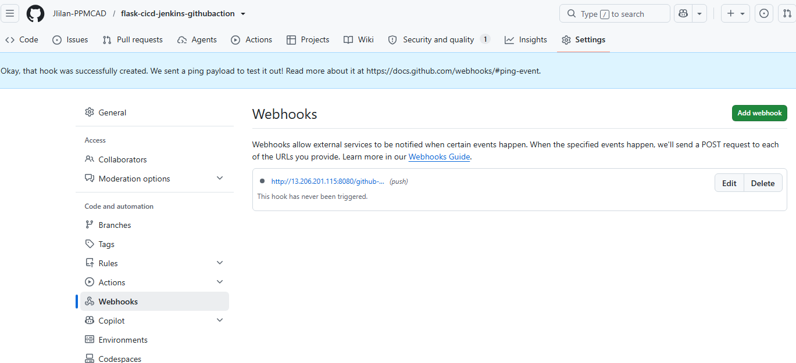


---

## 📧 Task Proof: Jenkins Automated Zoho Mail Alerts

To bypass traditional cloud port filtering and establish instant failure visibility, automated pipeline communications navigate safely via an encrypted Zoho SMTP relay channel using an authorized App Password configuration. If a build breaks, the pipeline attaches compressed operational log diagnostics (`flask_app.log`) directly to the outgoing delivery queue.

### Global SMTP Integration & Zoho Setup
*   **SMTP Server Target Address:** `smtp.zoho.in`
*   **Secure Routing Port:** `465` (SSL Active)
*   **System Identity Header / From:** `jilanshaik20@zohomail.in`


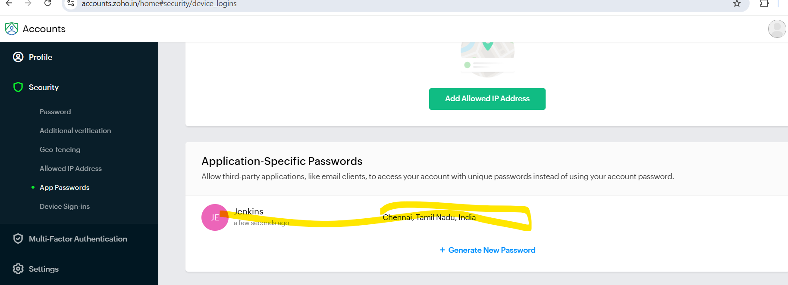

### Final Delivery Verification Receipt
The snapshot below confirms the automated dispatch and receipt of delivery updates within the verified Zoho mailbox structure:

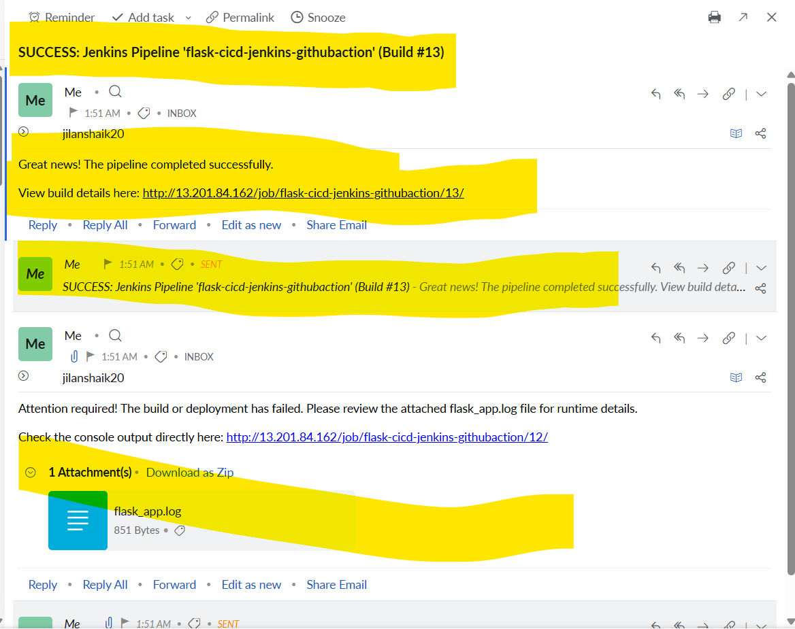

---

## 🤖 GitHub Actions Pipeline Monitoring

This secondary CI/CD infrastructure manages branch isolation, runs parallel automated test jobs, and establishes an active alert communication layer to provide status notifications directly to Zoho Mail.

### 1. Workflow Security, Variables, & Branch Layouts
Network destination addresses and key codes are protected under encrypted repository context variables, establishing secure operational execution fields based on branch labels.

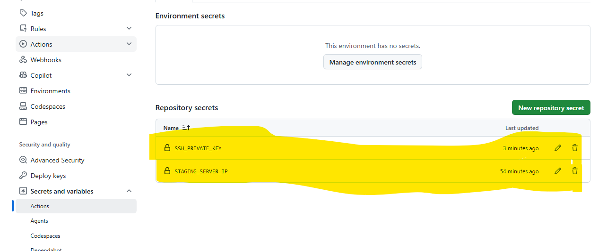
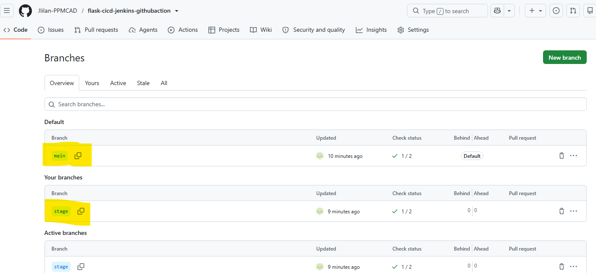

### 2. Parallel Integration and Test Matrix Runs
Every code change launches an isolated tracking instance, downloading application modules and running your complete `pytest` validation suite before approving the step.

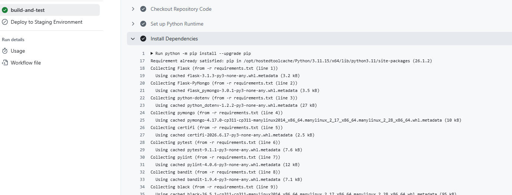
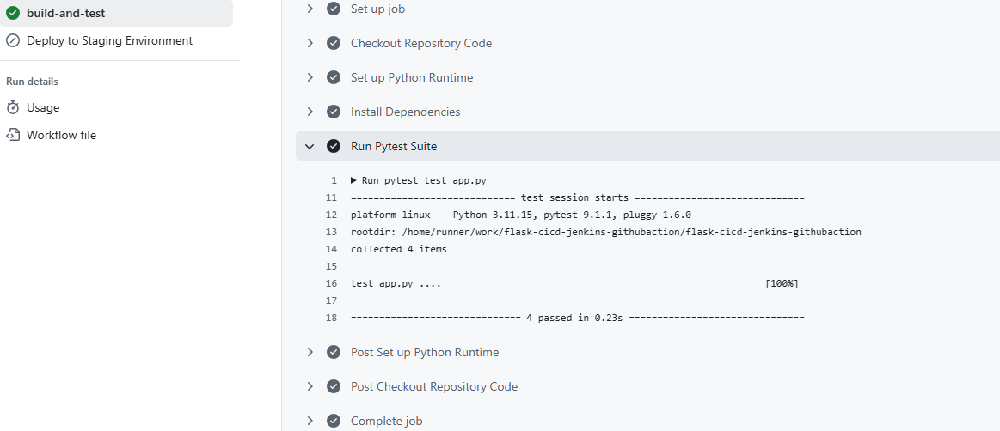

### 3. Native Deployment Handshakes & Release Tracking
Upon validation of dependencies, the pipeline triggers clean deployment scripts over independent hosting ports (`8001` and `8002`) via native SSH routing.

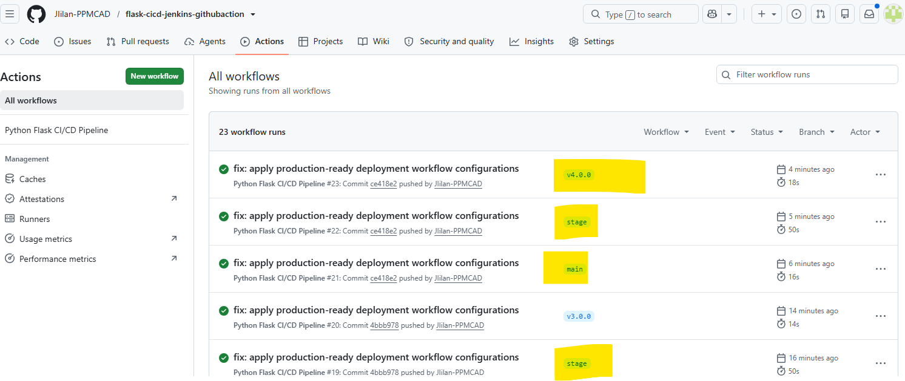

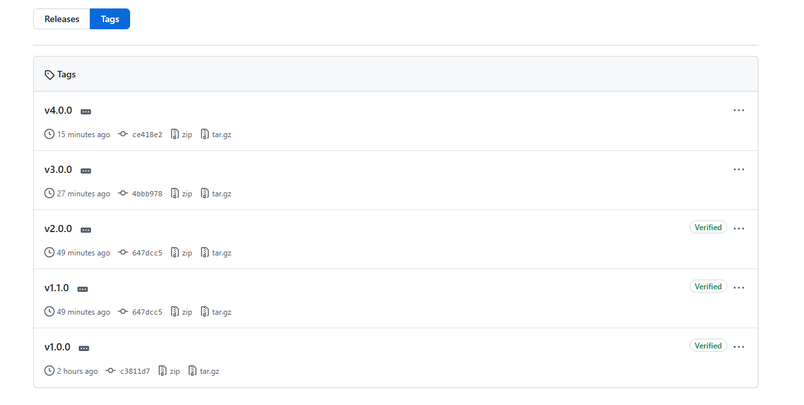
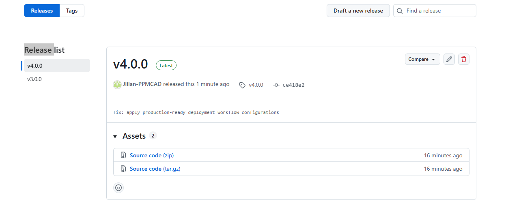

---

## 📨 Task Proof: GitHub Actions Automated Zoho Mail Alerts

To establish parity with the Jenkins infrastructure setup, an automated notification step utilizing the `dawidd6/action-send-mail@v4` library was integrated into the GitHub workflow engine. Using an encrypted repository token context (`secrets.ZOHO_MAIL_PASSWORD`), the runner extracts the runtime application diagnostic log (`flask_app.log`) from the host EC2 engine using secure copy routines (`scp`) and fires an automated status update to the engineering team.

### Runner Workflow Execution Logs
The console stream below highlights the successful assembly of the outbound SMTP envelope and the integration of attachment parameters:


### Final Delivery Verification Receipt
The screenshot below acts as a conclusive task check, validating that the GitHub Actions build runner managed to pass outer security layers and drop the active environment log right into the Zoho Inbox:

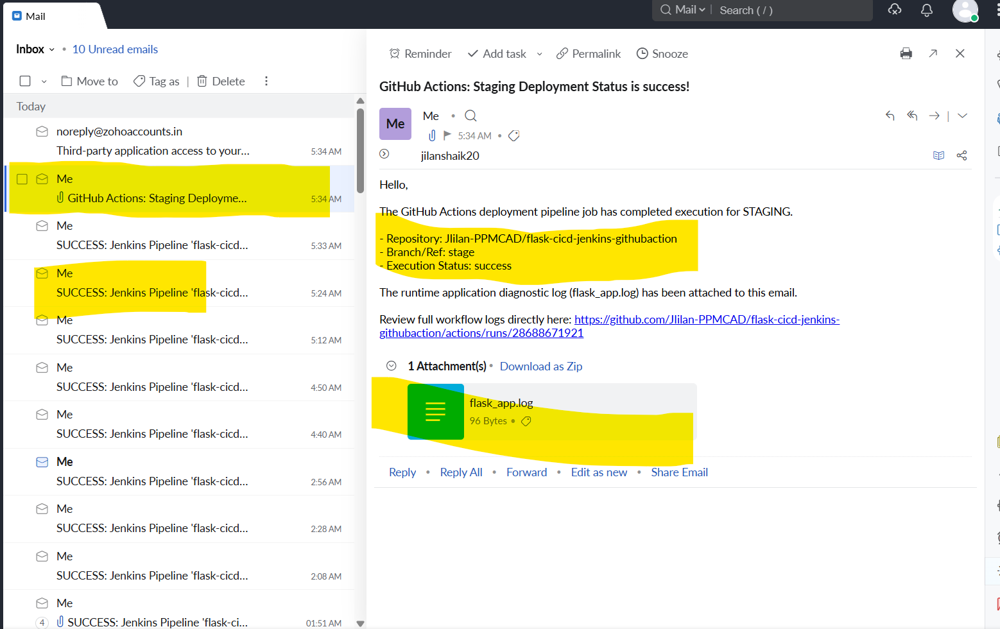

---

## 💻 Manual Setup & Configurations

### Local Execution Guide
```bash
# Clone the verified repository
git clone https://github.com
cd flask-cicd-jenkins-githubaction

# Create an isolated python context layer
python3 -m venv venv
source venv/bin/activate

# Resolve dependencies
pip install -r requirements.txt
pip install mongomock

# Launch the app
python3 app.py
```

### Runtime Environment Parameters (`.env`)
```env
MONGO_URI='mongodb://localhost:27017/student_db'
SECRET_KEY='jenkins_automation_secret_key_proof'
FLASK_ENV='staging'
```
