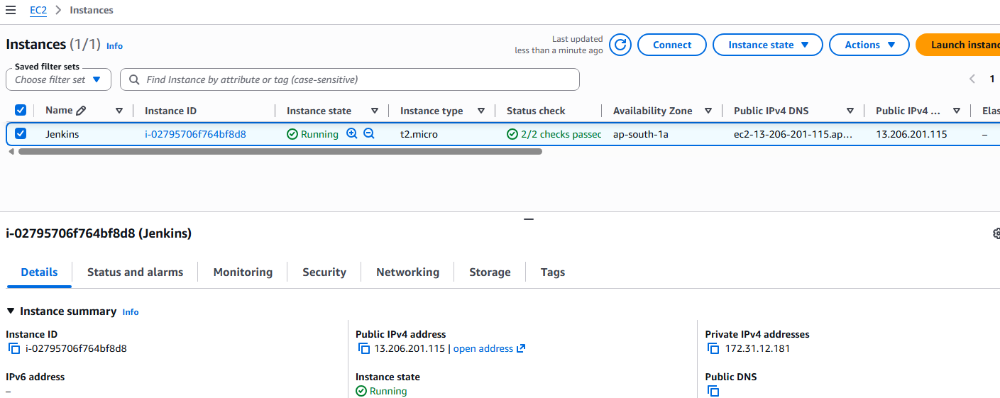
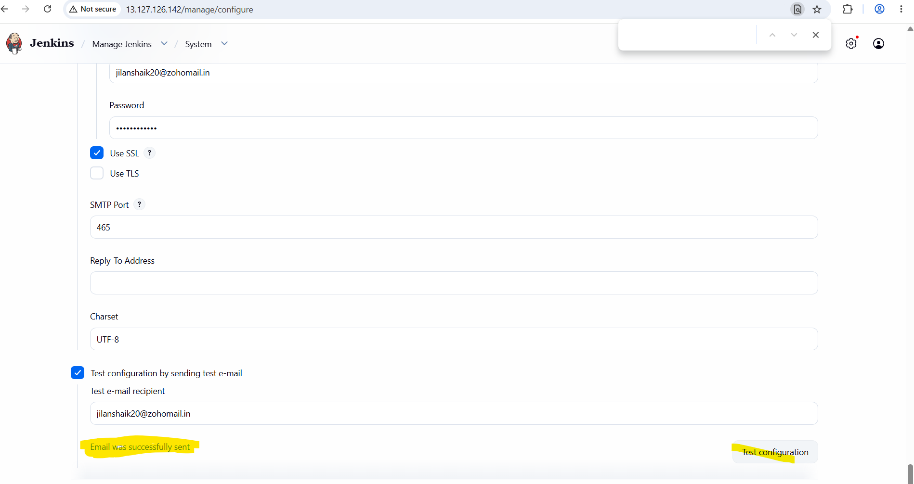
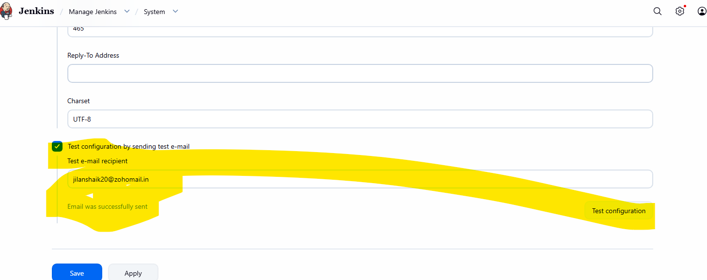
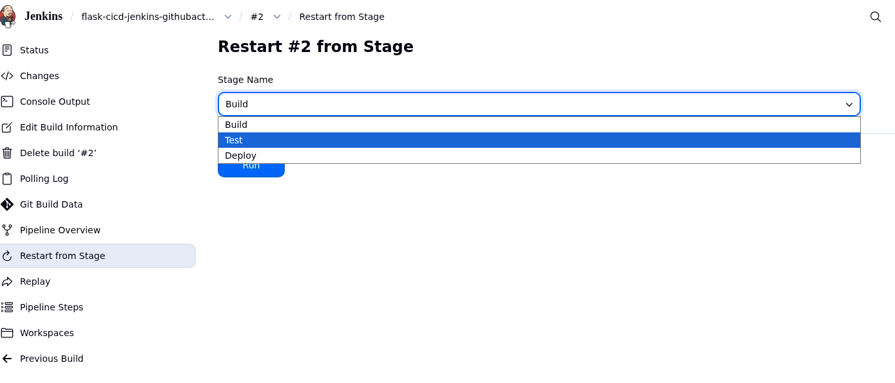
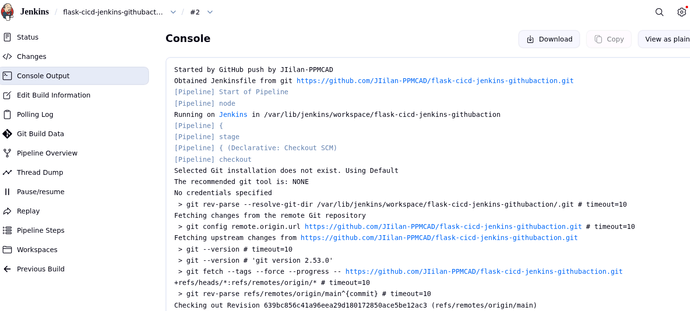
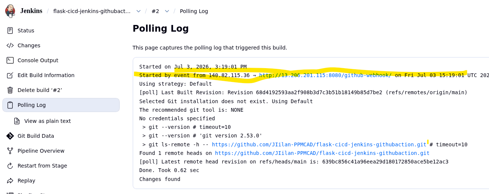

# Student Registration System & CI/CD Platform

A robust **Flask** web application designed to manage student records, integrated into an automated Continuous Integration and Continuous Deployment (CI/CD) pipeline using **Jenkins** and **GitHub Actions** with **MongoDB** (mocked in-memory via `mongomock` for testing and staging deployment).

---

## 🛠️ Tech Stack & Features

*   **Core Application:** Python, Flask, Jinja2 Templates, Bootstrap 5.
*   **Database Management:** MongoDB via `Flask-PyMongo` and `bson`.
*   **Testing Layer:** In-memory automation database simulation via `mongomock`.
*   **Automation Infrastructure:** Jenkins Pipeline Workspace Engine, GitHub Webhooks.
*   **Notification Engine:** Extended Jenkins Mail Delivery Server (SMTP over SSL).

---

## 🚀 Automated Pipeline Workflow

1.  **Developer Push:** A commit is pushed to the GitHub repository main branch.
2.  **Automated Webhook Trigger:** GitHub sends an instantaneous push event notification payload to the live Jenkins automation controller.
3.  **Build Stage:** Jenkins sets up an isolated Python virtual environment and resolves application dependencies.
4.  **Test Stage:** Execution of unit tests over an in-memory mock layout structure bypassing physical engine bounds.
5.  **Deploy Stage:** Automated lifecycle termination of stale processes on port 8000 and subsequent deployment of the updated application build.
6.  **Notification Block:** Generates email notifications with compressed operational log diagnostics attached (`flask_app.log`).

---

## 🔧 Infrastructure & Platform Configurations

### 1. Cloud Instance & Webhook Engine
The application runs on an AWS Ubuntu EC2 node. GitHub repositories stream operational triggers directly into the platform core using an active automated webhook pipeline.




### 2. Jenkins Extended Mail Server Integration (Zoho Mail)
To bypass outbound cloud port blocks and routing filters, Jenkins runs notifications through an encrypted Zoho India SMTP server setup:

*   **SMTP Server Target Address:** `smtp.zoho.in`
*   **Port Mapping:** `465` (Explicit SSL encryption)
*   **System Admin Header Identity:** `jilanshaik20@zohomail.in`




---

## 📊 Pipeline Monitoring & Results

### 1. Execution Logs & Successful Deployment Results
The unit tests utilize `mongomock` to evaluate the app state in memory, allowing them to pass successfully in less than a second. Once verified, the build step passes the health check on port 8000.





---

## 🤖 GitHub Actions Pipeline Monitoring (Upcoming)

This section acts as a technical placeholder for the secondary CI layer managed via internal GitHub workflow runners.

*   **GitHub Actions Workspace Location:** Images tracking individual matrix workflows will be uploaded here.
*   *[Placeholder for GitHub Action Step 1 Visual layout tracking log screenshots...]*
*   *[Placeholder for GitHub Action Step 2 Visual layout tracking log screenshots...]*

---

## 💻 Manual Setup & Configurations

### Local Execution Guide
```bash
# Clone the verified repository
git clone https://github.com
cd flask-cicd-jenkins-githubaction

# Create an isolated python context layer
python3 -m venv venv
source venv/bin/activate

# Resolve dependencies
pip install -r requirements.txt
pip install mongomock

# Launch the app
python3 app.py
```

### Runtime Environment Parameters (`.env`)
```env
MONGO_URI='mongodb://localhost:27017/student_db'
SECRET_KEY='jenkins_automation_secret_key_proof'
FLASK_ENV='staging'
```
